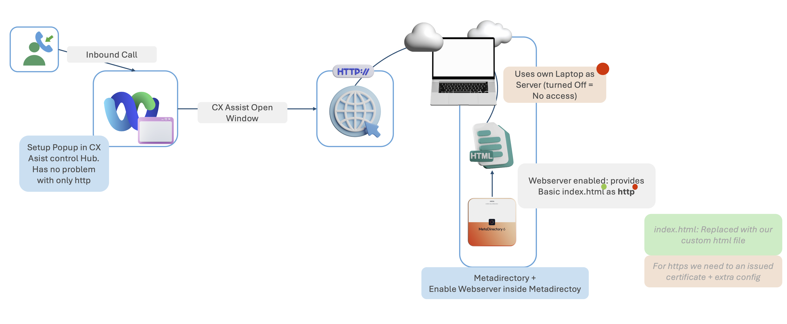
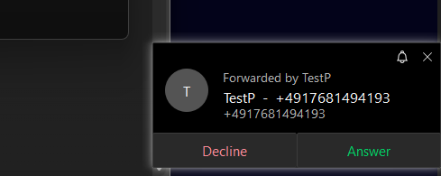
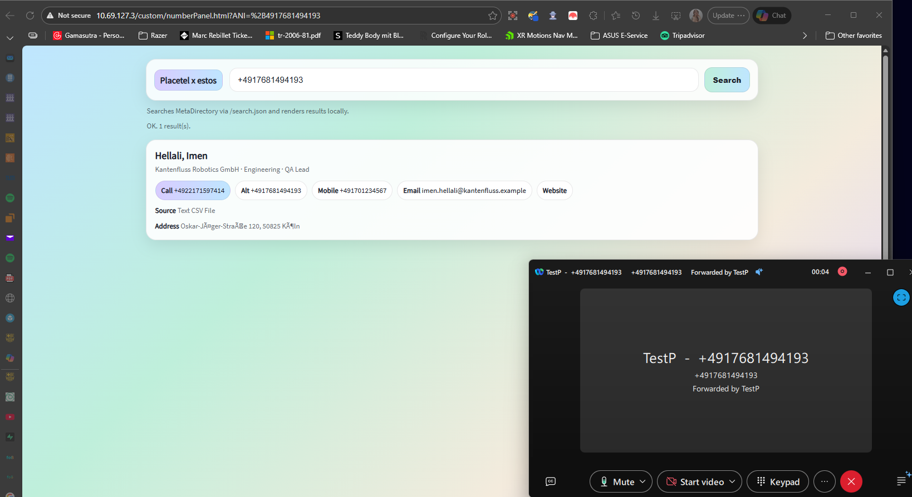

# EstosMDLocal
Placetel Webex x Estos MetaDirectory LOCAL server for Customer Assist Users 

https://github.com/ihella-p/EstosMDLocal/blob/main/demo.mp4

# Placetel × estos MetaDirectory – Webex Screen Pop

This repository provides a ready-to-use **Number Panel Screen Pop**
for Webex Customer Assist using **estos MetaDirectory** as the
contact lookup backend.

It enables:
- Automatic lookup by ANI (incoming phone number)
- Manual search by name or number
- lightweight UI
- Deployment without VPN using public **LOCAL** HTTP 

## Supported Systems
- estos MetaDirectory 6.x (Windows)
- Webex Customer Assist Licenses
- Azure or AWS Windows Server VM (Or Locally)

## What this repo contains
- `/custom` → files to copy into MetaDirectory `wwwroot`
- `/docs` → step-by-step setup guide with screenshots
- `/screenshots` → example UI and configuration steps

## What this repo does NOT contain
- estos MetaDirectory binaries
- Cisco Webex configuration files
- Any proprietary software

Proceed to the setup guide:
👉 `docs/01-prerequisites.md`

## Architecture

## What to Expect after Configuration
1. Receiving a Call through the Configured Queue 
    
2. Accepting a call -> resulting to openning a Browser window with the existing Contact data 
    
