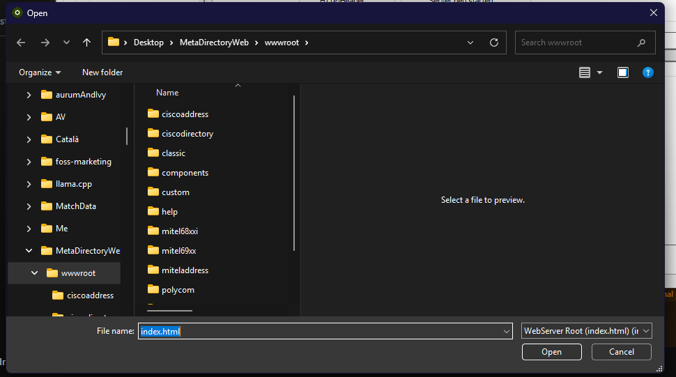
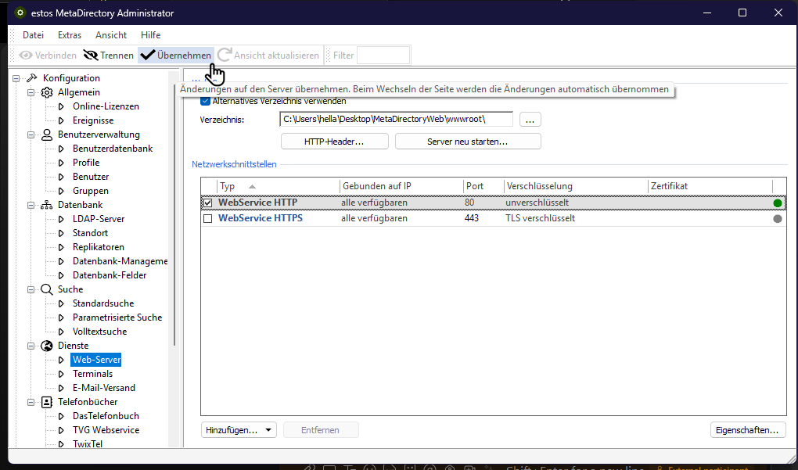
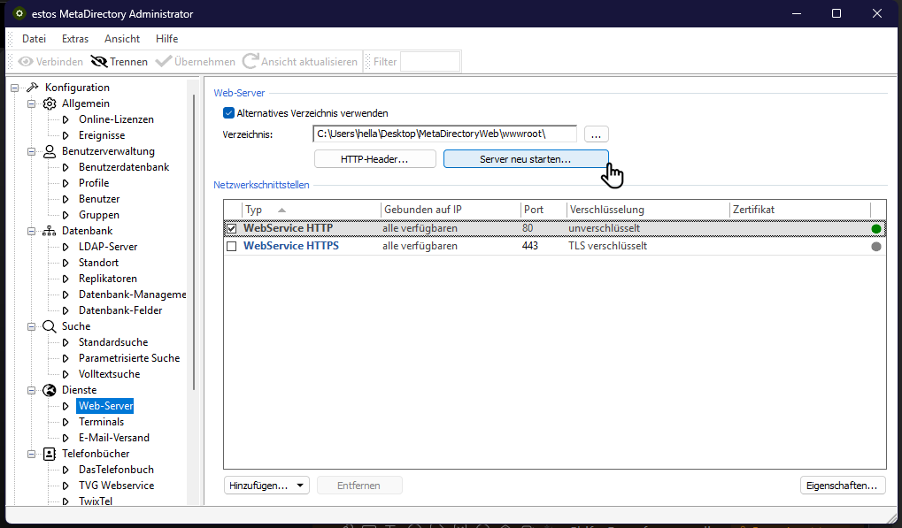

## Configure Alternate wwwroot Directory

1. In Web Server settings, enable:
   **Alternatives Verzeichnis verwenden**

2. Set path to our newly created Path:
   C:\Users\<yourUserName>\Desktop\MetaDirectoryWeb\wwwroot
   
   

3. Save your changes
   Klick on **Übernehmen**
   
   
4. Restart MetaDirectory Web Server
   Klick on **Server neu starten**
   

