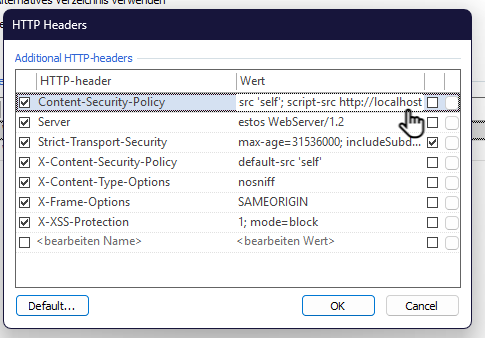

## Configure HTTP Security Headers (CSP)

1. In MetaDirectory Web Server settings
2. Open **HTTP Header**

    
3. Select **Content-Security-Policy**

    
4. Remove the Existing entries (Delete them all)
5. Set the new Content-Security-Policy:
    1. You must type the text below you cannot copy and paste **(Do not create new line - write all in one line!)**
        
        default-src 'self'; script-src 'self'; style-src 'self'; connect-src 'self'; img-src 'self' data:; font-src 'self'; script-src http://localhost

    2. **Klick on OK**
6. Save your changes
   Klick on **Übernehmen**
   
7. Restart MetaDirectory Web Server
   Klick on **Server neu starten**
   

