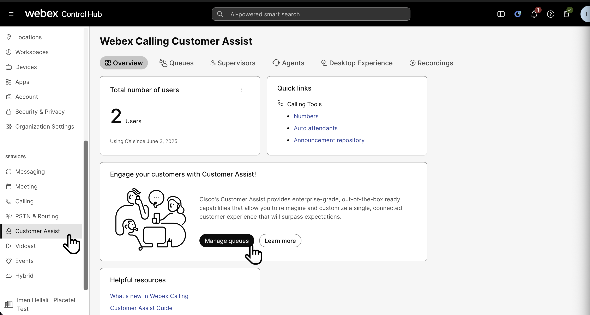
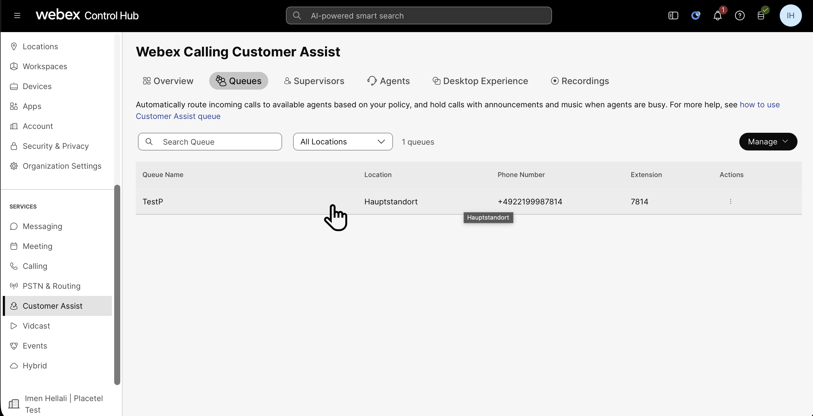
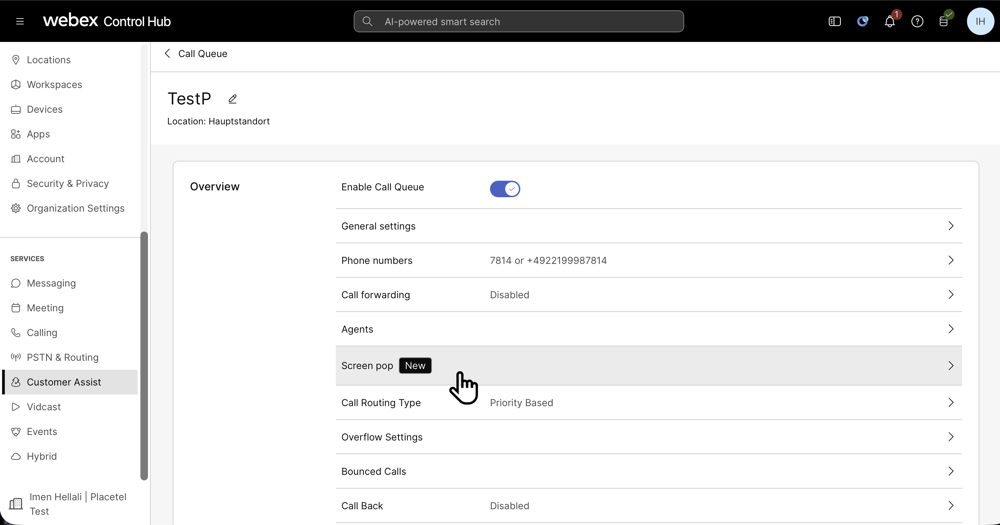
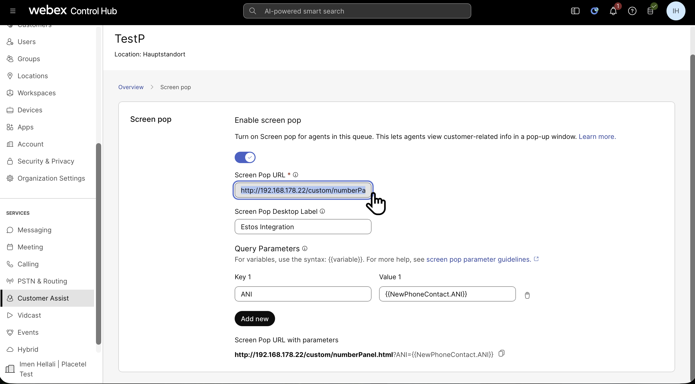

## Configure Webex Screen Pop

1. Open admin.webex.com
2. Navigate to Customer Assist
    

3. Configure a Queue 
    1. Follow the instructions if yo udid not configure yet
    2. In our case we have already Configured TestP that have already 2 Agents with Customer Assits Licenses **(You must have Agents with a Customer Assits License)**
        

4. Setup the Screen pop
    
    1. In Screen Pop URL write:  
        https://<IP-Adress>/custom/numberPanel.html
        The <IP-Adress> Is the WebService HTTP you configured and received from Metadirectory (In our Case it is my Local IPv4 from my lcoal Network for My Windows Laptop) -> Change that 
    2. Give it a Name
    3. For Query Parameters enter:
        1. ANI : Under Key
        2. {{NewPhoneContact.ANI}} : Under Value
        3. Save
    
