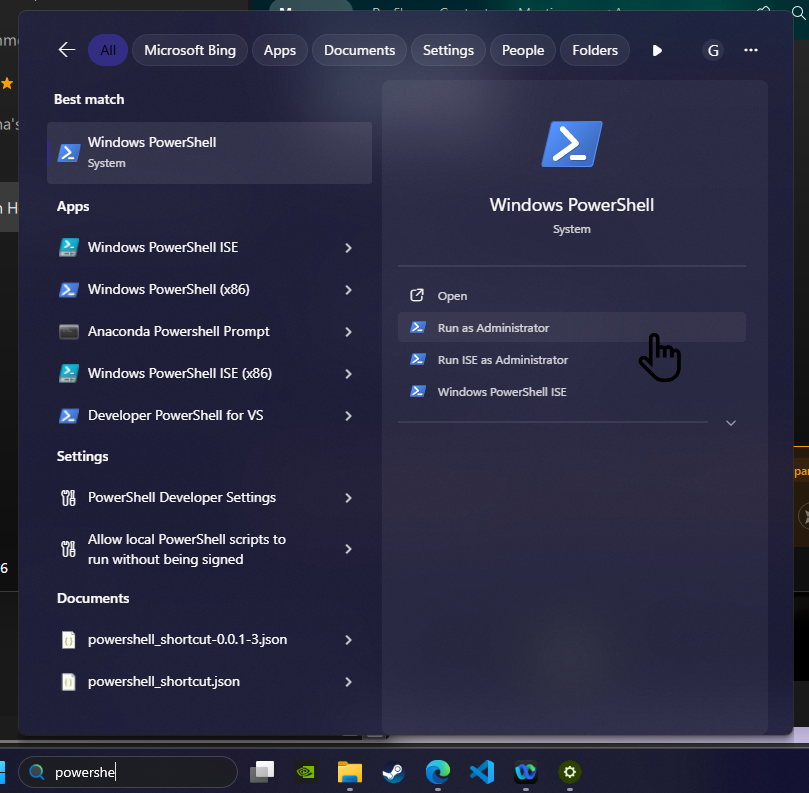
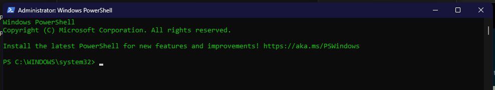

## Configure Powershell as Adminitrator or CMD as Administrator
Make your Webpage accessible for other Laptops and Browsers on your Network (e.g. Mac, Safari)
Open Powershell as Adminitrator 
    
Run this command    
    
### Locally HTTP (No Certificate)
    netsh advfirewall firewall add rule name="MetaDirectory HTTP 80" dir=in action=allow protocol=TCP localport=80
Make sure to change the port number to the port number you have
#### HTTPS (Certificate Configured)
    netsh advfirewall firewall add rule name="MetaDirectory HTTPS 443" dir=in action=allow protocol=TCP localport=443

Make sure to Update port number to the port number you have

## Checking ANI = +49....
In URL Query parameters, the **+** character is interpreted as a **space** unless it is URL-encoded ! we shoudl have covered this and it should work withour a problem! 
Just in case check that iin the Window Pop that it is written as **+49....** and not **49....**.
Metadirectory expects format of **+49**. Without the **+** no result will be returned!

## Check your Port is listening
Open Powershell and run
### Where you have Metadirectoy Server (installed) for HTTP
netstat -ano | findstr :80
### Where you have Metadirectoy Server (installed) for HTTPS
netstat -ano | findstr :443
### Another Machine 
open terminal or CMD or Powershell, change the server-ip with the weblink and run
    curl -v http://<!server-ip>/
### Changing Network (WIFI)
you must change your IPv4 Adress from the Webex Screen Pop Configuration

